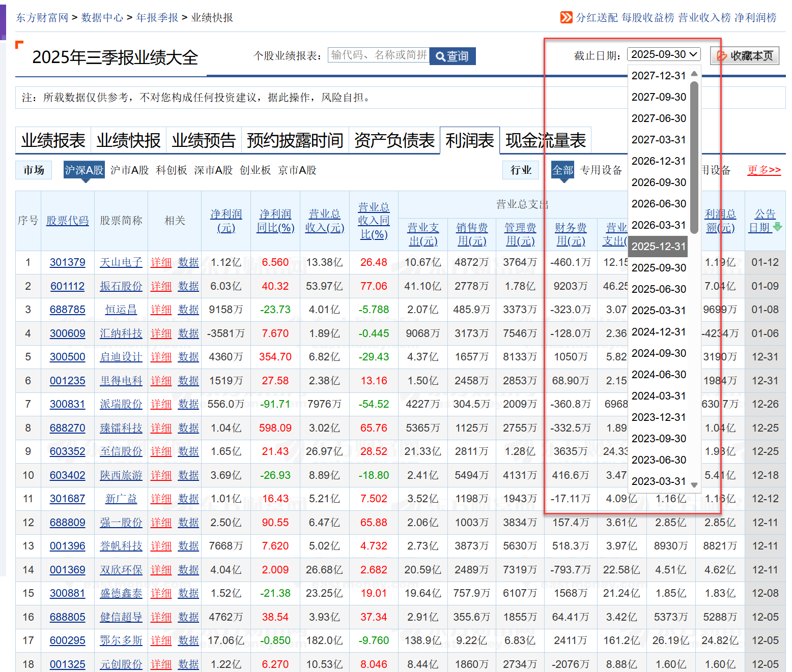
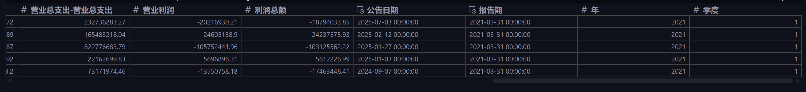
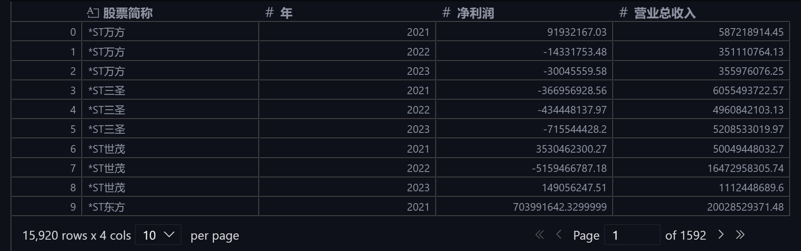
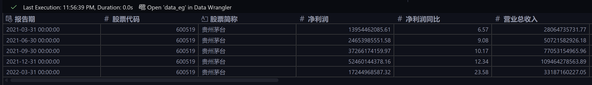
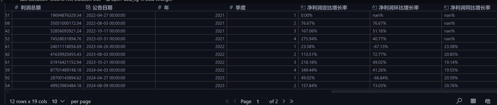

# akshare 批量获取上市公司利润表并分析

## 前言

本案例来自[ Python财务数据分析与应用（微课版）](https://www.ryjiaoyu.com/book/details/51983) 一书第四章**财务数据获取及分析**的本章实训部分。


开卷有益，虽然我也常用 `akshare` 获取股票数据，但更多的是交易数据。不看这本书还真不知道可以用 `stock_lrb_em` 函数批量获取所有上市公司的利润表数据，我一直以为得先构建个股票列表，然后再循环获取每个股票的利润表数据🤣

## 实训案例

### 一、案例介绍

> 上市公司利润表数据是投资者进行价值评估和投资决策的核心依据。随着我国资本市场的不断完善和财务信息披露制度的规范化，及时准确地获取和分析企业利润表数据对投资机构、个人投资者及企业管理者都具有重要意义。特别是在白酒行业面临消费升级和市场竞争加剧的背景下，深入分析企业盈利能力和增长趋势，对把握行业投资机会和风险管控具有重要价值。

### 二、实训目标

> 完成数据获取、处理、统计分析和增长率计算等任务，掌握上市公司利润表数据分析的完整方法论，提升财务数据分析与投资价值评估的实战能力。

### 三、实训任务

> 1. 通过 Python 编程批量获取上市公司 2021—2023 年的季度利润表数据，并保存为本地文件，命名为“2021—2023 年季度利润表.xlsx”。
> 2. 取本地文件 `2021-2023 年季度利润表.xlsx`，观察数据的数据量、变量个数及变量类型，并将“报告期”列转换为字符串。
> 3. 根据“报告期”列构建“年”“季度”变量，并进行数据分组统计，计算年度的“净利润”和“营业总收入”，以及不同股票年度的“净利润”和“营业总收入”。
> 4. 提取贵州茅台的季度利润表，并对贵州茅台的“净利润”和“营业总收入”进行基本统计分析。
> 5. 以“2021-03-31”为基准，计算贵州茅台的净利润定比增长率、净利润环比增长率、净利润同比增长率。

## 案例实现

### 任务一：数据获取

既然知道了 `ak.stock_lrb_em` 函数可以批量获取所有上市公司某个报告期的利润表数据，那么获取数据就很简单。只需要构建一个包含所有报告期的列表，然后循环调用该函数获取数据并合并即可：

```python
datelist = [
    f"{year}{d}"
    for year in (2021, 2022, 2023)
    for d in ("0331", "0630", "0930", "1231")
]

data = pd.concat(
    [ak.stock_lrb_em(date=d).assign(报告期=d) for d in datelist], ignore_index=True
)
data.to_excel("2021—2023年季度利润表new.xlsx", index=False)
```

至于为什么报告期参数是 `20210331` 这种格式，首先 `stock_lrb_em` 函数的默认参数是 `date: str = "20081231"`。其次，该函数爬取的是东方财富网页（形如：https://data.eastmoney.com/bbsj/202003/lrb.html ），可以打开该网页研究确认，发现原网页有可选的下拉框：



### 任务二：读取本地数据

```python
data = pd.read_excel("2021—2023年季度利润表new.xlsx")
data.info()
data["报告期"] = data["报告期"].astype("str")
data.info()
```

这部分很简单，不用多说。不过，如果需求是把“报告期”列转换为字符串类型的话，可以在读取 Excel 文件时直接指定该列的数据类型：

```python
data = pd.read_excel("2021—2023年季度利润表new.xlsx", dtype={"报告期": "str"})
data.info()
```

这样更加简洁高效。输出：

```jupyter
<class 'pandas.core.frame.DataFrame'>
RangeIndex: 62102 entries, 0 to 62101
Data columns (total 16 columns):
 #   Column       Non-Null Count  Dtype
---  ------       --------------  -----
 0   序号           62102 non-null  int64
 1   股票代码         62102 non-null  int64
 2   股票简称         62102 non-null  object
 3   净利润          62100 non-null  float64
 4   净利润同比        60399 non-null  float64
 5   营业总收入        62063 non-null  float64
 6   营业总收入同比      60332 non-null  float64
 7   营业总支出-营业支出   60283 non-null  float64
 8   营业总支出-销售费用   59461 non-null  float64
 9   营业总支出-管理费用   61481 non-null  float64
 10  营业总支出-财务费用   60347 non-null  float64
 11  营业总支出-营业总支出  61554 non-null  float64
 12  营业利润         61954 non-null  float64
 13  利润总额         61963 non-null  float64
 14  公告日期         62102 non-null  datetime64[ns]
 15  报告期          62102 non-null  object
dtypes: datetime64[ns](1), float64(11), int64(2), object(2)
memory usage: 7.6+ MB
```

这里要注意，<mark>输出的信息中可以观察到有些数据列存在缺失值。这个时候，应该要对缺失值进行处理或者搞清楚为什么会缺失，要不然然后续的分析可能会受到影响</mark>。书上没做，这就不做了。

### 任务三：分组统计

首先，把“报告期”列转换为日期类型，然后提取“年”“季度”变量：

```python
data["报告期"] = pd.to_datetime(data["报告期"], format="%Y%m%d", errors="coerce")
data["年"] = data["报告期"].dt.year
data["季度"] = data["报告期"].dt.quarter
data.head()
```



然后，可以用 `pivot_table` 函数进行分组统计：

```python
pd.pivot_table(
    data, values=["净利润", "营业总收入"], index=["股票简称", "年"], aggfunc=sum
).reset_index()
```



当然，这个过程也可以用 `groupby` 函数实现，但是 `pivot_table` 更加简洁直观。

### 任务四：贵州茅台分析

提取贵州茅台的数据，可以用 `query` 方法：

```python
# data_eg = data.iloc[np.where(data["股票简称"] == "贵州茅台")].reset_index()
data_eg = data.query("股票简称 == '贵州茅台'").reset_index()
data_eg.head()
```

书中是用注释的那句实现的，太笨了😉

接着，进行基本统计分析：

```python
data_eg[["净利润", "营业总收入"]].describe()
```

然后，做了年度的净利润和营业总收入的数据透视表：

```python
pd.pivot_table(
    data_eg, values=["净利润", "营业总收入"], index=["年"], aggfunc=sum
).reset_index()
```

显然，这些分析很基础。完全可以绘制图表进行可视化分析，比如折线图、柱状图等，更加直观地展示贵州茅台的盈利能力和增长趋势。但是，书上第五章才讲可视化，这里就不展开了。

### 任务五：增长率计算

要计算增长率，首先要把“报告期”列设置为索引，并顺便删除不必要的列（看着不舒服）：

```python
data_eg.set_index("报告期", inplace=True)
data_eg.drop(columns=["index", "序号"], inplace=True)
data_eg.head()
```



定比增长率的计算公式为：

$$
\text{定比增长率} = \frac{\text{本期数} - \text{基期数}}{\text{基期数}} \times 100\%
$$

```python
fix_date = "2021-03-31"
fix_num = data_eg.loc[fix_date, "净利润"]
data_eg["净利润定比增长率"] = data_eg["净利润"] / fix_num - 1
data_eg["净利润定比增长率"] = data_eg["净利润定比增长率"].apply(
    lambda x: "{:.2f}%".format(x * 100)
)  # 百分比格式
```

环比增长率的计算公式为：

$$
\text{环比增长率} = \frac{\text{本期数} - \text{上期数}}{\text{上期数}} \times 100\%
$$

```python
data_eg["净利润环比增长率"] = data_eg["净利润"].pct_change(periods=1)
data_eg["净利润环比增长率"] = data_eg["净利润环比增长率"].apply(
    lambda x: "{:.2f}%".format(x * 100)
)  # 百分比格式
```

同比增长率的计算公式为：

$$
\text{同比增长率} = \frac{\text{本期数} - \text{去年同期数}}{\text{去年同期数}} \times 100\%
$$

```python
data_eg["净利润同比增长率"] = data_eg["净利润"].pct_change(periods=4)
data_eg["净利润同比增长率"] = data_eg["净利润同比增长率"].apply(
    lambda x: "{:.2f}%".format(x * 100)
)  # 百分比格式
```

在计算环比和同比增长率时，使用了 `pct_change` 方法，这个方法非常方便，可以直接计算百分比变化。只需要指定 `periods` 参数即可。
最后，查看结果：

  

## 后记

从学习的角度来说，这是个不错的案例。 它涵盖了数据获取、处理、分组统计和增长率计算等多个方面的内容，考验读者的 `pandas` 的应用能力。

<mark>学习需要举一反三</mark>，既然会读取利润表进行分析，那么读取资产负债表和现金流量表进行类似的分析应该要会了。只需要用 `ak.stock_zcfz_em` 和 `ak.stock_xjll_em` 函数读取相应的数据即可。这章的实战演练部分，就是让读者去读取资产负债表进行类似的分析。**建议读者自己动手实践一下，加深理解**。

本文完整代码，可在公众号后台回复关键词 `量化研究` 获取，也可以访问我的[ GitHub 代码仓库](https://github.com/purequant/QuantitativeResearch)获取。