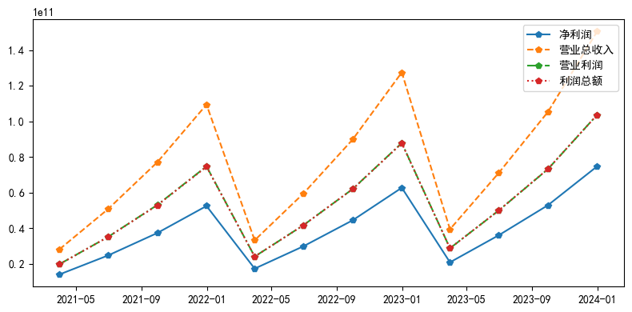
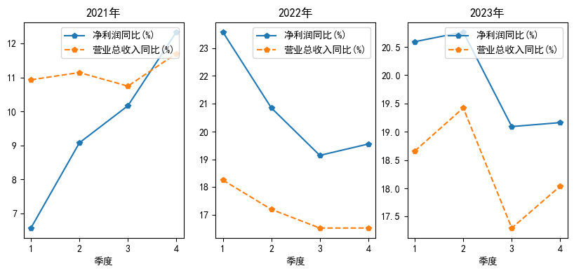
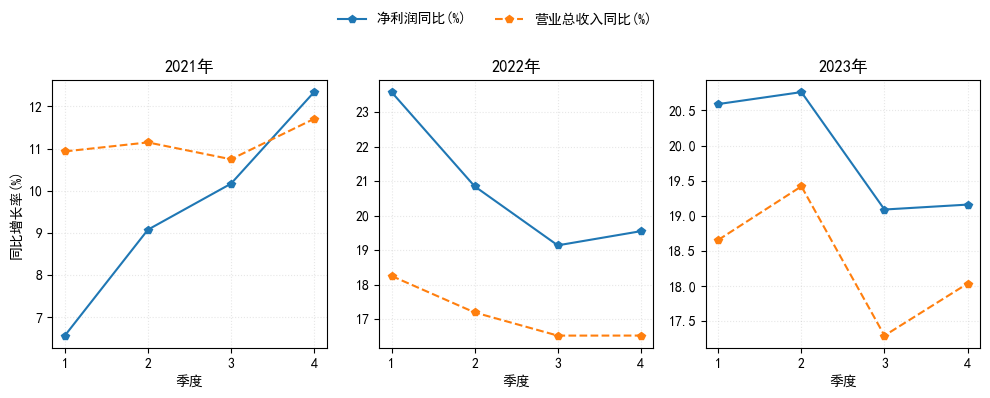
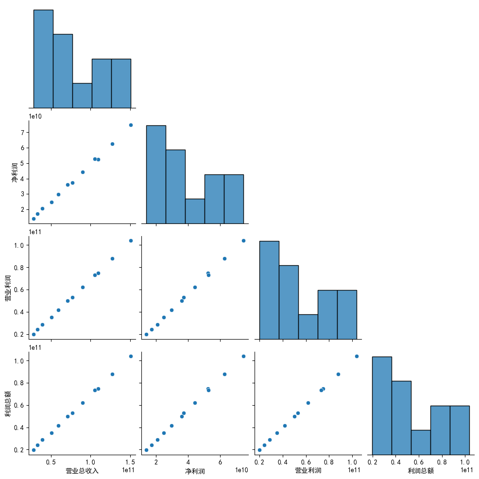
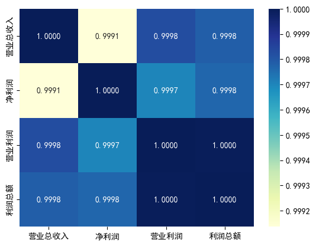
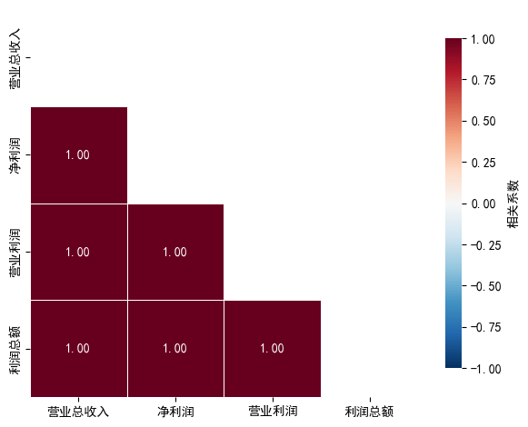

# 上市公司财务指标可视化分析

## 前言

本案例来自[ Python财务数据分析与应用（微课版）](https://www.ryjiaoyu.com/book/details/51983) 一书第五章**财务数据可视化**的本章实训部分。


这章主要讲如何用 `matplotlib` 绘制常见的图形，内容很基础。不过学习编程就是要多动手，学完书本的案例，很有必要自己动手实践一下🤣

不过即便内容比较基础，但<mark>如果想要绘制出精美的图片，还是有很多可以调整的空间</mark>。

## 实训案例

### 一、案例介绍

> 利润表数据是评估企业经营质量和盈利能力的关键依据。本实训以知名上市公司为研究对象，
> 聚焦 2021-2023 年季度利润表核心指标的可视化分析。随着注册制改革投资的深入推进
> 投资者对财务数据的解读能力要求日益提高。特别是在当前经济转型期，通过多维度利
> 润指标分析，可以深入把握企业的的盈利模式、成长性和财务健康度，为价值投资决策提供数据支撑。

### 二、实训目标

> 本项目采用 Python 数据可视化技术，实现从基础财务数据到专业分析图表的全流程呈现。

### 三、实训任务

> 1. 绘制“净利润”、“营业总收入”、“营业利润”、“利润总额”随时间变化的多线图，并显示图例。
> 1. 创建 1 行 3 列的子图，绘制一组反映该公司 2021—2023 年的季度净利润同比增长率和营业总收入同比增长率变化的图表。
> 1. 绘制“营业总收入”、“净利润”、“营业利润”、“利润总额”的散点矩阵图。
> 1. 绘制“营业总收入”、“净利润”、“营业利润”、“利润总额”的相关系数热力图。

## 案例实现

### 任务一

任务一比较简单，可以用 `for` 循环绘制多条折线图，代码如下：

```python
data = pd.read_excel("贵州茅台2021—2023年季度利润表.xlsx")
display(data)
data.info()
plt.figure(figsize=(8, 4))

cols = ["净利润", "营业总收入", "营业利润", "利润总额"]
linestyles = ["-", "--", "-.", ":"]

for col, ls in zip(cols, linestyles):
    plt.plot(data["报告期"], data[col], marker="p", linestyle=ls, label=col)

plt.legend(loc="upper right")
plt.tight_layout()
plt.show()
```

效果如下：



### 任务二

任务二书上代码如下：

```python
# 定义年份并遍历
years = [2021, 2022, 2023]
fig, axs = plt.subplots(1, 3, figsize=(10, 4))
for i, year in enumerate(years):
    # 筛选特定年份的数据
    year_data = data[data["年"] == year]
    axs[i].plot(year_data["季度"], year_data["净利润同比"], marker="p", linestyle="-")
    axs[i].plot(
        year_data["季度"], year_data["营业总收入同比"], marker="p", linestyle="--"
    )
    axs[i].set_title(str(year) + "年")
    axs[i].set_xlabel("季度")
    axs[i].legend(["净利润同比(%)", "营业总收入同比(%)"], loc="upper right")
plt.show()
```

效果如下：



这三个子图之间图例是一样的，只显示一个图例即可，改进代码如下：

```python
years = [2021, 2022, 2023]
metrics = [("净利润同比", "-"), ("营业总收入同比", "--")]

# fig, axs = plt.subplots(1, len(years), figsize=(10, 4), sharey=True)
fig, axs = plt.subplots(1, len(years), figsize=(10, 4))

for ax, y in zip(axs, years):
    yd = data.query("年 == @y").sort_values("季度")
    for m, ls in metrics:
        ax.plot(yd["季度"], yd[m], marker="p", linestyle=ls, label=f"{m}(%)")
    ax.set(title=f"{y}年", xlabel="季度")
    ax.set_xticks([1, 2, 3, 4])
    ax.grid(alpha=0.3, linestyle=":")

axs[0].set_ylabel("同比增长率(%)")

# 只放一份图例（更简洁）
handles, labels = axs[0].get_legend_handles_labels()
fig.legend(handles, labels, loc="upper center", ncol=2, frameon=False)

fig.tight_layout(rect=[0, 0, 1, 0.9])
plt.show()
```

效果如下：



改进的代码，还包括了一些高级点的用法，比如 `query` 方法、`set` 方法、`fig.legend` 方法等，感兴趣的同学可以多研究一下。

### 任务三

任务三需要绘制散点矩阵图，可以用 `seaborn` 库的 `pairplot` 方法，代码如下：

```python
import seaborn as sns

# corner 参数的作用是只显示下三角
sns.pairplot(data=data[["营业总收入", "净利润", "营业利润", "利润总额"]], corner=True)
plt.show()
```

效果如下：



### 任务四

任务四需要绘制相关系数热力图，可以用 `seaborn` 库的 `heatmap` 方法，书本原始代码如下：

```python
cor = data[["营业总收入", "净利润", "营业利润", "利润总额"]].corr()
sns.heatmap(
    cor,  # 相关系数
    cmap="YlGnBu",  # 用于指定颜色映射
    annot=True,
    fmt=".4f",
)  # annot表示热力图上是否显示数据；结果保留4位小数
plt.show()
```

效果：



这张图显示了颜色条，可以区分不同的相关系数的大小。但是**这张图中的实际数值差距很小，但是颜色却相差很大，容易造成误解**。对于这张图，也可以通过一系列设置进行美化：

```python
cor = data[["营业总收入", "净利润", "营业利润", "利润总额"]].corr()

# 只显示下三角，避免信息重复
mask = np.triu(np.ones_like(cor, dtype=bool))

sns.heatmap(
    cor,  # 相关系数
    mask=mask,
    cmap="RdBu_r",  # 发散色带：正相关偏红，负相关偏蓝
    vmin=-1,
    vmax=1,
    # center=0,  # 固定范围，便于不同图之间比较
    annot=True,
    fmt=".2f",
    square=True,  # 方格更规整
    linewidths=0.6,  # 方格线宽
    linecolor="white",  # 方格线色
    cbar_kws={"shrink": 0.85, "label": "相关系数"},  # 显示
)  # annot表示热力图上是否显示数据；结果保留4位小数

ax.set_title("关键财务指标相关系数热力图", pad=12)
ax.set_xticklabels(ax.get_xticklabels(), rotation=30, ha="right")
ax.set_yticklabels(ax.get_yticklabels(), rotation=0)

plt.tight_layout()
plt.show()
```

美化效果如下：



其中比较难理解的参数是 `cbar_kws` 参数：

> `cbar_kws` 是 **seaborn 里传给颜色条（colorbar）的参数字典**，常用在 `sns.heatmap()` 这种会生成颜色条的图里。
> 
> - 作用：用来控制右侧（或下方）颜色条的样式/行为，比如大小、标签、刻度等
> - 当前代码里：`cbar_kws={"shrink": 0.85, "label": "相关系数"}` 表示
> - `shrink=0.85`：把颜色条长度缩短到原来的 85%（看起来更紧凑）
> - `label="相关系数"`：给颜色条加一个标题文字

该参数还能这样使用：

```python
sns.heatmap(cor, cbar_kws={"orientation": "horizontal"})  # 横向颜色条
sns.heatmap(cor, cbar_kws={"ticks": [-1, -0.5, 0, 0.5, 1]})  # 自定义刻度
sns.heatmap(cor, cbar_kws={"pad": 0.02})  # 调整颜色条与图的间距
```

## 后记

本章内容虽然比较基础，但是对于初学者而言，仍是不错的实践材料！

本文完整代码，可在公众号后台回复关键词 `量化研究` 获取，也可以访问我的[ GitHub 代码仓库](https://github.com/purequant/QuantitativeResearch)获取。