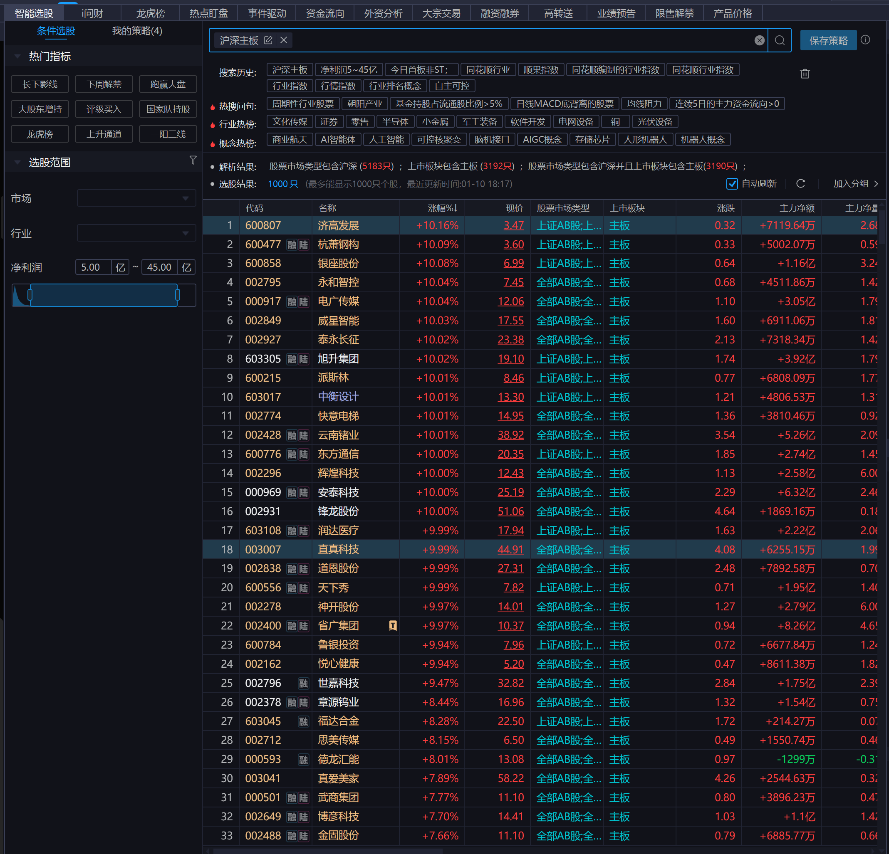
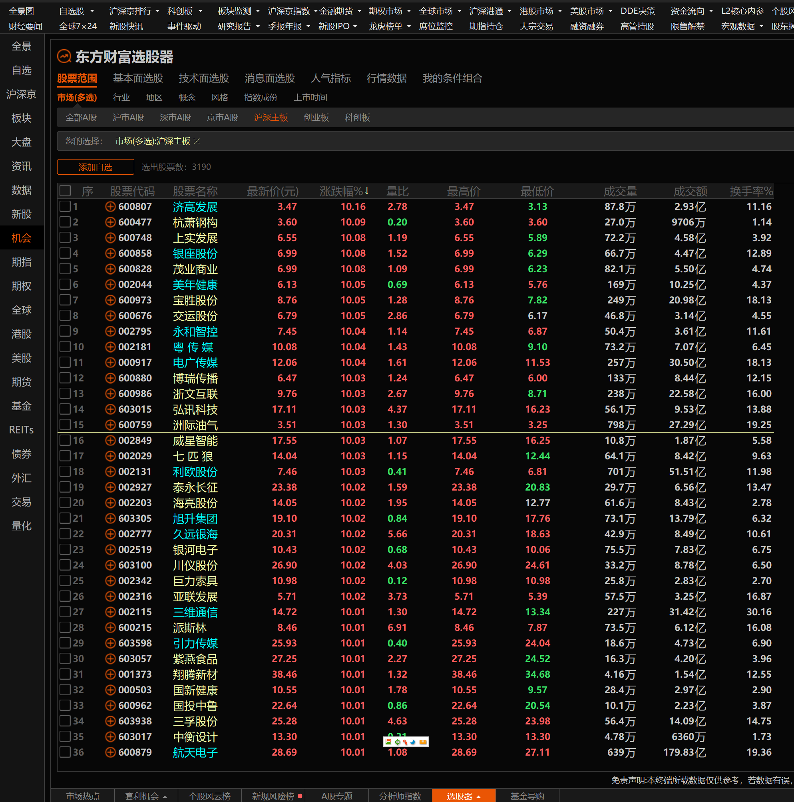
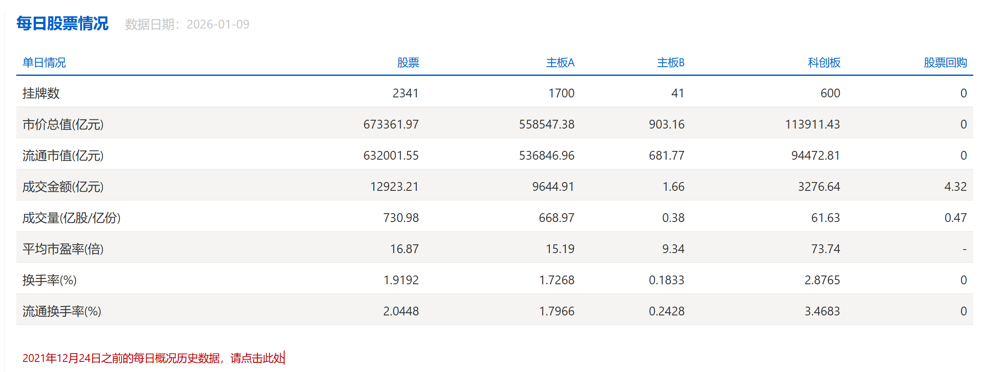
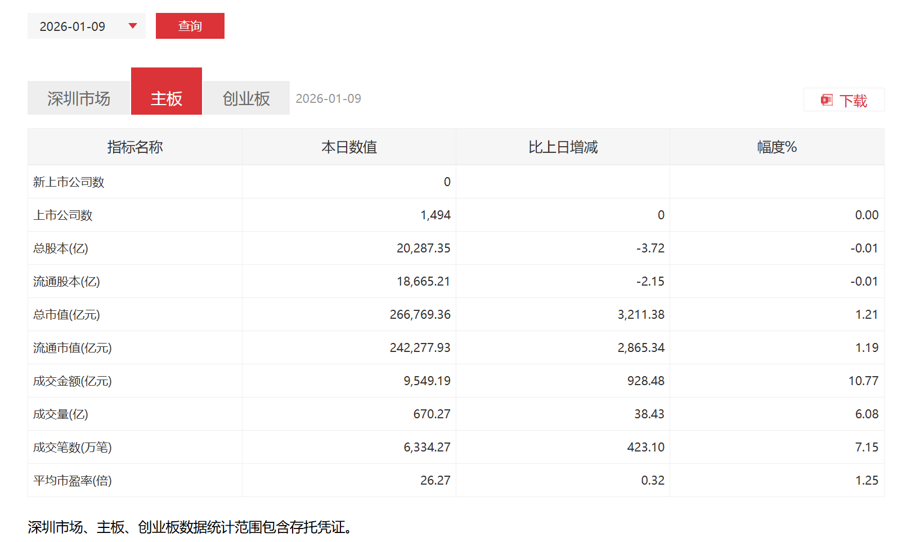
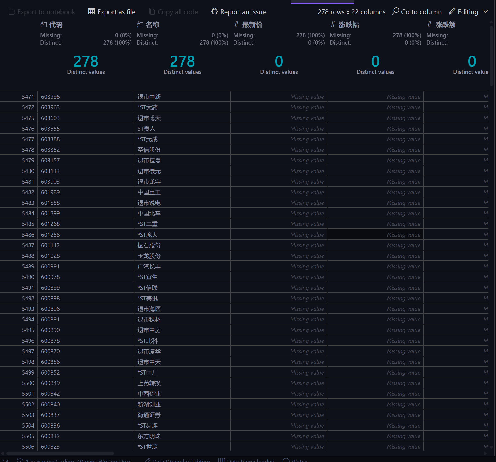
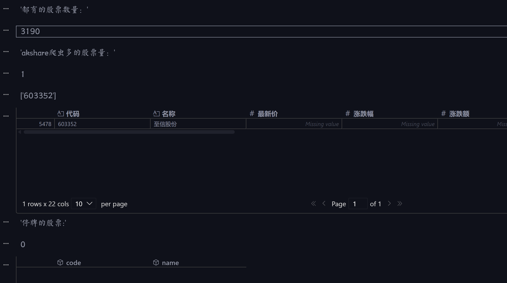

# 我国沪深主板 A 股到底有多少只股票?

## 前言

昨天写天[复盘笔记](https://mp.weixin.qq.com/s/PQryLAU7pvQ2VBdyz8vobQ)时，让问财算这一周A股主板的平均涨幅，结果为`4.63%`，担心笨笨的问财算不准，准备自己验证一下。所以，首要的问题是：我国沪深主板 A 股到底有多少只股票?

## 解决方案

可以从一些常用的炒股软件和交易所官网查询。

### 同花顺

直接问问财，结果是 `3190`只。 也可以用同花顺条件选股，直接把这些股票选出来：



可以看到具体的股票名单，也可以保存为自选股，但是无法直接导出。本想导出来验证，同花顺有点麻烦就算了。

### 东方财富

东方财富用选股器，也是 `3190`只：



这一点看，东方财富比同花顺方便多了。

### akshare 数据

akshare 是常用的金融数据获取工具，用 akshare 来获取沪深主板 A 股名单试试：

```python
import akshare as ak

stock_zh_a_spot_em_df = ak.stock_zh_a_spot_em()
print(stock_zh_a_spot_em_df)
print(f"沪深京的股票总数量: {len(stock_zh_a_spot_em_df)}")

# 从stock_zh_a_spot_em_df数据框中筛选出沪深主板的股票
# 根据代码的前两位判断是否为主板股票
main_board_stocks = stock_zh_a_spot_em_df[
    stock_zh_a_spot_em_df["代码"].str.startswith(("00", "60"))
]
# 删除序号这一列
main_board_stocks = main_board_stocks.drop(columns=["序号"])

print(f"沪深主板的股票数量: {len(main_board_stocks)}")
# 计算沪市主板和深市主板的股票数量
sh_main_board_count = len(
    main_board_stocks[main_board_stocks["代码"].str.startswith("60")]
)
sz_main_board_count = len(
    main_board_stocks[main_board_stocks["代码"].str.startswith("00")]
)
print(f"沪市主板股票数量: {sh_main_board_count}")
print(f"深市主板股票数量: {sz_main_board_count}")
```

这段代码中 `akshare` 抓取了东方财富（https://quote.eastmoney.com/center/gridlist.html#hs_a_board）网页数据，然后根据股票代码的前两位来判断是否为主板股票。

> 沪深主板股票代码最核心的特点是**沪市以 60 开头**、**深市以 00 开头**，均为**6 位数字编码**，且全面注册制后中小板已合并到深交所主板，原 002/003 开头股票也归为深市主板。以下是详细说明（豆包生成）：

#### 一、沪市主板（上交所）代码特点

1.  **核心标识**：以**60**开头，是沪市主板最明显的特征
2.  **具体代码段**：
    | 代码段 | 启用时间 | 典型特征 | 代表股票 |
    |--------|----------|----------|----------|
    | 600xxx | 早期启用 | 最老牌沪市主板股票，数量最多 | 贵州茅台 (600519)、云南白药 (600538) |
    | 601xxx | 2006 年起 | 中字头大型国企聚集地，多为金融、能源、基建巨头 | 工商银行 (601398)、中国石油 (601857) |
    | 603xxx | 2014 年起 | 新股发行代码段，多为新兴行业龙头 | 中国国航 (601111)、晨光文具 (603899) |
    | 605xxx | 2020 年起 | 注册制改革后新增代码段，用于主板新股 | 南钢股份 (605005)、威派格 (605056) |
3.  **特殊情况**：沪市 B 股以**900**开头，与 A 股区分

#### 二、深市主板（深交所）代码特点

1.  **核心标识**：以**00**开头，是深市主板的基本特征
2.  **具体代码段**：
    | 代码段 | 历史渊源 | 现状 | 代表股票 |
    |--------|----------|------|----------|
    | 000xxx | 早期启用 | 深市老牌主板股票 | 平安银行 (000001)、万科 A(000002) |
    | 001xxx | 特殊用途 | 深市主板新股及特殊股票 | 平安银行曾用 001000、招商蛇口 (001979) |
    | 002xxx/003xxx | 原中小板 | 2021 年 4 月 6 日合并到深市主板 | 比亚迪 (002594)、大族激光 (002008) |
3.  **特殊情况**：深市 B 股以**200**开头，如万科 B(200002)

但是，这段代码输出的结果却挺有意思：

```
沪深主板的股票数量: 3468
沪市主板股票数量: 1837
深市主板股票数量: 1631
```

这里得到的股票数量可多了不少，得好好验证一下，**到底怎么回事**？

### 交易所官网

最权威的肯定是交易所的官网，[上交所](https://www.sse.com.cn/assortment/stock/list/share/) 和 [深交所](https://www.szse.cn/market/product/stock/list/?tabkey=tab1&selectModule=main) 经过耐心查看，都可以找到下载股票名单的地方。

上交所主板 A 股有 `1700`只股票：



深交所主板 A 股有 `1494`只股票：



扣除 4 只 B 股，深交所主板 A 股实际有 `1490`只股票。

加起来正好是 `3190`只股票，也就是说<mark>截止 2026 年 1 月 10 日，我国沪深交易所主板共有`3190`只 A 股股票</mark>。这证明同花顺和东方财富的数量是对的。为了更加严谨，我把上交所和深交所的名单都下载下来，准备和东方财富的名单以及 akshare 抓取的名单进行对比。

## 名单对比

首先，把上交所和深交所的股票名单合并成一个 DataFrame：

```python
import pandas as pd

sh_file = "上交所主板a股股票列表GPLIST.xls"
sz_file = "深交所主板A股列表.xlsx"

sh_df = pd.read_excel(sh_file)
display(sh_df)
sz_df = pd.read_excel(sz_file, dtype={"A股代码": str})
display(sz_df)
# 从sh_df 取去A股代码和证券简称两列
# 从sz_df 取去A股代码和A股简称两列
# 拼接两个数据DataFrame
combined_df = pd.concat(
    [
        sh_df[["A股代码", "证券简称"]].rename(
            columns={"A股代码": "code", "证券简称": "name"}
        ),
        sz_df[["A股代码", "A股简称"]].rename(
            columns={"A股代码": "code", "A股简称": "name"}
        ),
    ],
    ignore_index=True,
)
display(combined_df)
print(f"沪深主板股票总数量: {len(combined_df)}")
```

然后从东方财富下载的主板 A 股名单读取数据：

```python
# 这个文件虽然是 .xls 扩展名，但实际是 GBK 编码的制表符分隔文本；
em_df = pd.read_csv(
    "东方财富主板a股列表.xls",
    encoding="gbk",
    delimiter="\t",
)
display(em_df)
# 提取股票代码的6位数字
em_df["股票代码"] = em_df["股票代码"].str.extract(r"(\d{6})")
display(em_df)
# 只保留股票代码和股票名称两列
em_df = em_df[["股票代码", "股票名称"]].rename(
    columns={"股票代码": "code", "股票名称": "name"}
)
display(em_df)
print(f"东方财富主板股票总数量: {len(em_df)}")
```

先对比东方财富和交易所的名单：

```python
# 对比 em_df 和 combined_df 的每一条数据是否一致（按 code 对齐）
def compare_code_series(a: pd.Series, b: pd.Series):
    sa = set(a.astype(str).str.extract(r"(\d{6})", expand=False).dropna())
    sb = set(b.astype(str).str.extract(r"(\d{6})", expand=False).dropna())
    return sorted(sa & sb), sorted(sa - sb), sorted(sb - sa)


common, a_more, b_more = compare_code_series(em_df["code"], combined_df["code"])
display("都有的股票数量：", len(common))
```

结果是这两个名单完全一致。

那现在问题来了，akshare 抓取的名单为什么会多出这么多股票呢？我们来对比一下 akshare 抓取的名单和交易所的名单：

```python

common, a_more, b_more = compare_code_series(
    main_board_stocks["代码"], combined_df["code"]
)
display("都有的股票数量：", len(common))
display("akshare爬虫多的股票量：", len(a_more))
# display(a_more)
# 根据a_more从main_board_stocks提取DataFrame
more_df = main_board_stocks[main_board_stocks["代码"].isin(a_more)]
display(more_df)
```
结果发现 akshare 抓取的名单多出了 `278`只股票，而且这些全部是已经退市的股票：

  

所以，疑问解开了，东方财富网站上仍然保留了退市股票的信息，而交易所官网上已经将这些退市股票剔除了。 akshare 抓取的数据是基于东方财富网站的，因此包含了这些退市股票。

##  如何从 akshare 中直接获取主板 A 股名单？

那么问题来了，一般情况下使用 akshare 抓取的数据最方便，总不可能每次去东方财富把主板股票名单导出来再使用吧？那么<mark>该如何从 akshare 抓取的数据中过滤掉退市股票呢</mark>？

通过研究，发现<mark>退市股票没有市盈率-动态的数据</mark>，因此可以通过这个字段来过滤掉退市股票：

```python
# main_board_stocks_filtered = main_board_stocks.dropna(subset=["流通市值"])
main_board_stocks_filtered = main_board_stocks.dropna(subset=["市盈率-动态"])
main_board_stocks_filtered
# 对比 main_board_stocks_filtered 和 combined_df  看到底多了哪只股票
common, a_more, b_more = compare_code_series(
    main_board_stocks_filtered["代码"], combined_df["code"]
)
display("都有的股票数量：", len(common))
display("akshare爬虫多的股票量：", len(a_more))
display(a_more)
# 查询爬虫多出的股票
more_df1 = main_board_stocks_filtered[main_board_stocks_filtered["代码"].isin(a_more)]
display(more_df1)
# 查询东方财富名单多出的股票
display("东方财富名单多出的股票数量:", len(b_more))
suspended_df = combined_df[combined_df["code"].isin(b_more)]
display(suspended_df)
```

当然，你可能有疑问：为什么不用最新价等其他数据去过滤退市股票呢？比如，有些停牌的股票也没有最新价数据。所以，经过尝试发现，市盈率-动态这个字段是最合适的。不过，以上代码返回的结果中，显示爬虫抓取的名单仍然多出了一只股票 `至信股份`：

  

这只股票刚发布中签结果，马上就要上市了，东方财富网页手速真快啊🤣

既然搞清楚了多了个待上市的股票，那么通过分析，发现再加个 **流通市值** 指标就可以完美过滤掉退市和待上市的股票了：

```python
# main_board_stocks_filtered = main_board_stocks.dropna(subset=["流通市值"])
main_board_stocks_filtered = main_board_stocks.dropna(
    subset=["市盈率-动态", "流通市值"]
)
main_board_stocks_filtered
# 对比 main_board_stocks_filtered 和 combined_df  看到底多了哪只股票
common, a_more, b_more = compare_code_series(
    main_board_stocks_filtered["代码"], combined_df["code"]
)
display("都有的股票数量：", len(common))
display("akshare爬虫多的股票量：", len(a_more))
display(a_more)
# 查询爬虫多出的股票
more_df1 = main_board_stocks_filtered[main_board_stocks_filtered["代码"].isin(a_more)]
display(more_df1)
# 查询东方财富名单多出的股票
display("东方财富名单多出的股票数量:", len(b_more))
# 修复索引对齐问题：应在 main_board_stocks_filtered 上使用其自身的布尔索引
suspended_df = main_board_stocks[main_board_stocks["代码"].isin(b_more)]
display(suspended_df)
```

这样就完美解决了问题，最终得到的沪深主板 A 股名单和交易所官网以及东方财富网站上的名单完全一致，共有 `3190`只股票。

## 后记

虽然，这个问题看似简单，但是要弄清楚其中的细节还是挺费了一番功夫的。通过这个过程，也弄明白了一些细节。希望对大家有所帮助！

既然有了正确的沪深主板 A 股名单，那么就可以做很多事情。比如，计算这一周的平均涨幅，问财只会告诉你简单算数平均涨幅，但是现在**数据在我们手上，还可以进一步挖掘，比如计算个市值加权平均涨幅等等**。总之，可以做很多事情，具体请看后续的文章。今天就先写到这里吧。

## 资源下载

本文中涉及到的代码和数据，可以公众号后台回复`量化研究`获取，也可以通过[GitHub 仓库](https://github.com/purequant/QuantitativeResearch) 获取。