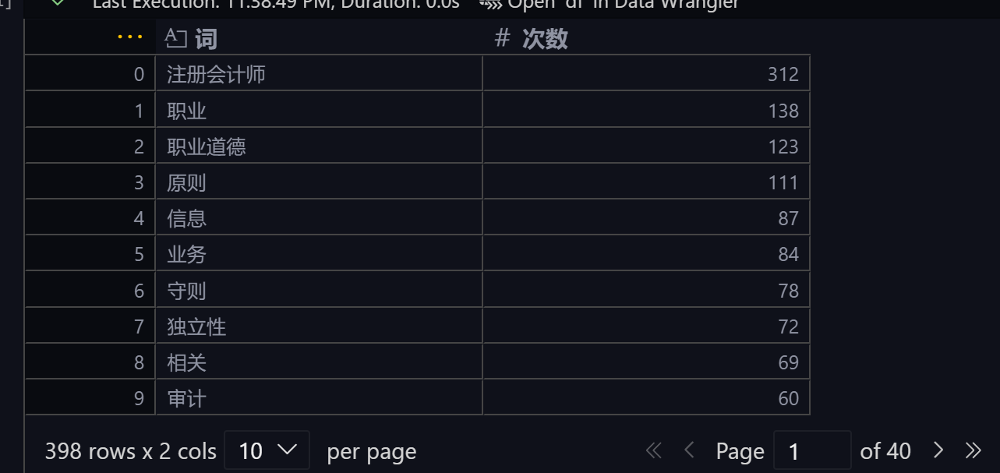
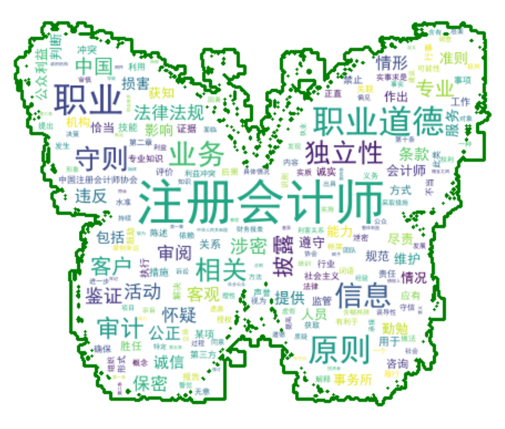
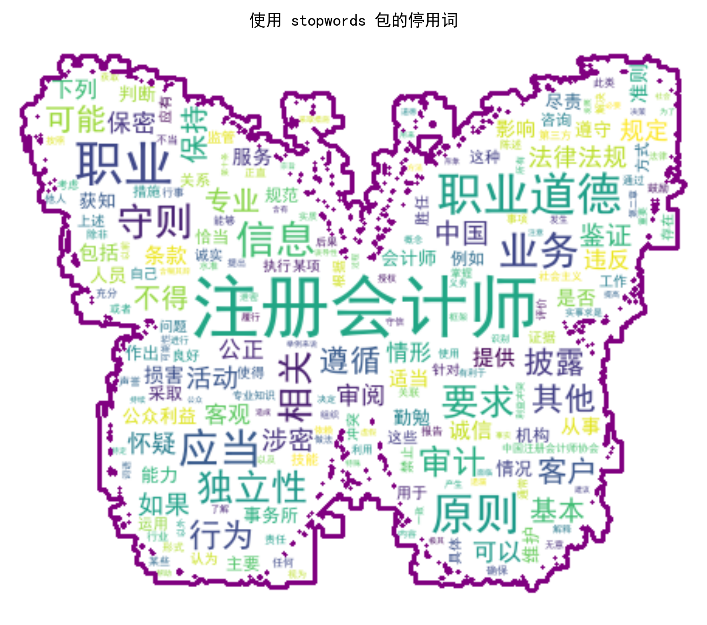

# 读取 pdf 文本并词云绘制

[toc]

## 前言

本案例来自[ Python财务数据分析与应用（微课版）](https://www.ryjiaoyu.com/book/details/51983) 一书第五章**财务数据可视化**的本章实训部分。


**词云图（Word Cloud）是一种通过词语的频率来展示文本内容的可视化图形**。词云图可以帮助我们快速了解文本中的高频词汇，从而把握文本的主题和核心内容。

绘制词云图并不复杂，主要步骤包括文本预处理、分词、词频统计和词云图绘制。下面我们将通过一个实训案例来演示如何使用 Python 绘制词云图。

## 实训案例

### 案例介绍

本案例以《中国注册会计师职业道德守则（2020））文本为例，演示如何使用 `wordcloud` 库绘制词云图。

### 实训目标

从文本预处理开始，进行分词和词频统计，最后生成词云图。

### 实训任务

1. 利用 Python 读取文件“中国注册会计师职业道德守则.pdf”，并将该文件转换为.txt 文件，命名为“中国注册会计师职业道德守则.txt”。
2. 利用 Python 读取“中国注册会计师职业道德守则.txt”文件，观察该数据有什么问题，并对该数据进行清洗。
3. 对该文本进行初步分词，统计词频，观察高频词，构建词典。
4. 调用停用词文件，重新进行分词，并进行词频统计，将词频保存为文件“词频.xlsx”。
5. 读取词云图背景图片“蝴蝶.png”，绘制词云图。

## 案例实现

### 任务一

利用 `pdfplumber` 库读取文件：

```python
import pdfplumber

filename = "中国注册会计师职业道德守则.pdf"
with pdfplumber.open(filename) as pdf:
    for i, page in enumerate(pdf.pages):
        text = page.extract_text()
        txt_file = open("中国注册会计师职业道德守则.txt", mode="a", encoding="utf-8")
        txt_file.write(text)
        print(f"第{i + 1}页提取完成")
txt_file.close()
print("所有页面提取完成，txt文件生成完毕")
```

### 任务二

输出前 2000 个字符观察：

```python
import pprint

content = open("中国注册会计师职业道德守则.txt", "r", encoding="utf-8").read()
pprint.pprint(content[:2000])  # 打印前2000个字符，观察数据问题
```

输出结果如下（截取部分）：

```text
('附件 1：\n'
 '中国注册会计师职业道德守则第 1 号\n'
 '——职业道德基本原则\n'
 '（2020 年 12 月 17 日修订）\n'
 '第一章 总 则\n'
 '第一条 为了规范注册会计师职业活动，提高注册会计师职业道\n'
 '德水准，维护注册会计师职业形象，根据《中华人民共和国注册会计\n'
 '师法》和《中国注册会计师协会章程》，制定本守则。\n'
 '第二条 维护公众利益是注册会计师行业的宗旨。公众不仅包括\n'
 '注册会计师服务的客户，也包括投资者、债权人、政府机构、社会公\n'
 '众等其他可能依赖注册会计师提供的信息以作出相关决策的组织或\n'
 '人员。这种依赖赋予注册会计师维护公众利益的责任。从这个意义上\n'
 '说，公众利益可以定义为那些可能依赖注册会计师工作的组织或人员\n'
 '的整体利益。\n'
 '注册会计师应当遵守中国注册会计师职业道德守则（以下简称职\n'
 '业道德守则），履行相应的社会责任，维护公众利益。为了维护公众\n'
 '利益，注册会计师应当持续提高职业素养。\n'
 '在履行社会责任的过程中，注册会计师可能面临不同组织或人员\n'
 '相互之间的利益冲突。在解决这些冲突时，注册会计师应当正直诚实\n'
 '行事，并始终牢记维护公众利益的宗旨。\n'
 '1第三条 注册会计师应当遵守相关法律法规。如果某些法律法规\n'
 '的规定与职业道德守则的相关条款不一致，注册会计师应当注意到这\n'
 '些差异。除非法律法规禁止，注册会计师应当按照较为严格的规定执\n'
 '行。\n'
 '第四条 在极其特殊的情况下，如果认为遵守职业道德守则的某\n'
 '些规定可能会导致不当后果或不符合公众利益，注册会计师可以考虑\n'
 '向中国注册会计师协会或相关监管机构咨询。\n'
 '第五条 职业道德守则中的条款，按照其效力和使用方法，可以\n'
 '分为三类：\n'
 ```

观察可知，这个文本输出可以看出几个明显的问题：

1. **页码数字混入正文**：
   - `'1第三条'` - 页码"1"直接粘在"第三条"前面
   - `'2注册会计师的行为'` - 页码"2"在句首
   - `'3（四）专业胜任能力'` - 页码"3"混入
   - `'4位。'` - 页码"4"在句尾

2. **大量换行符**（`\n`）：
   - 几乎每句话后面都有换行，导致文本碎片化
   - 对于后续的词频统计和词云生成会造成干扰

3. **可能还有其他隐藏问题**：
   - 空格（虽然在这个输出中不太明显）
   - 页眉页脚信息
   - 格式符号

   所以，需要用正则表达式进行文本清洗。代码如下：

```python
# re.sub()替换字符串
# 去掉所有换行符（将文本拼成一行）
content = re.sub(r"\n", "", content)

# 去掉所有空格（包含英文半角空格）
content = re.sub(" ", "", content)

# 去掉所有数字（如页码、条款编号等）
content = re.sub(r"\d+", "", content)
```

**注意**：使用原始字符串 `r""` 来书写正则表达式，避免反斜杠转义冲突。Python 字符串中 `\d` 不是合法转义序列，会产生 `SyntaxWarning`。使用 `r"\d+"` 可以让反斜杠原样传递给 `re` 模块，语义更清晰。

### 任务三

利用下面代码进行初步分词和词频统计：

```python
from collections import Counter

words = jieba.lcut(content)
word_counts = Counter(words)  # 统计词频
word_counts
```

输出结果如下（截取部分）：

```text
Counter({'的': 165,
         '，': 141,
         '会计师': 112,
         '注册': 104,
         '。': 85,
         '（': 52,
         '）': 52,
         '职业': 47,
         '或': 47,
         '和': 45,
         '在': 43,
         '职业道德': 41,
         '原则': 37,
         '；': 36,
         '、': 34,
         '应当': 32,
         '信息': 29,
         '业务': 28,
         '守则': 26,
         '要求': 24,
         '独立性': 24,
   ```

从上面的词频统计结果可以看出存在以下问题：

1. **标点符号占据高频位置**：
   - `'，'` (141 次)、`'。'` (85 次)、`'（'` (52 次)、`'）'` (52 次)
   - `'；'` (36 次)、`'、'` (34 次)、`'：'` (18 次)、`'—'` (20 次)
   - 这些标点符号对词云分析毫无意义，需要过滤掉

2. **单字词过多且无实际意义**：
   - `'的'` (165 次)、`'或'` (47 次)、`'和'` (45 次)、`'在'` (43 次)
   - `'对'` (23 次)、`'时'` (21 次)、`'其他'` (18 次)
   - 这些是停用词，对主题分析没有贡献

3. **分词粒度不合理**：
   - `'会计师'` (112 次) 和 `'注册'` (104 次) 被分开了
   - 实际上 "注册会计师" 应该作为一个完整词汇
   - `'职业'` (47 次) 和 `'职业道德'` (41 次) 也存在类似问题

**解决方案**：
1. 使用**停用词表**过滤掉无意义的高频词和标点符号
2. 使用**自定义词典**让 jieba 识别专业术语（如"注册会计师"、"职业道德守则"等）
3. 重新进行分词和词频统计

### 任务四

调用停用词文件，重新进行分词，并进行词频统计，将词频保存为文件“词频.xlsx”。

```python
# 1) 只加载一次用户词典（避免反复执行该单元格时重复加载）
if not hasattr(jieba, "_userdict_loaded"):
    jieba.load_userdict("我的词典V2.txt")
    jieba._userdict_loaded = True

# 2) 读取停用词：自动跳过空行，strip 后去重
with open("停用词.txt", "r", encoding="utf-8") as _f:
    stopwords = {line.strip() for line in _f if line.strip()}

# 额外补充的停用词
stopwords |= {"—", "时", "\x0c", "二", "三", "四", "中", "号"}

# 3) 过滤规则：集中到一个函数里，便于维护
_punc_re = re.compile(r"^[\W_]+$")  # 纯标点/符号（含全角标点）/下划线


def keep_token(w: str) -> bool:
    w = w.strip()
    if not w or w in stopwords:
        return False
    if len(w) < 2:  # 通常单字信息量低（可按需要改成 <1）
        return False
    if w.isdigit():  # 纯数字丢弃
        return False
    if _punc_re.match(w):  # 纯符号丢弃
        return False
    return True


# 4) 用 jieba.cut + Counter 的生成器统计：不构造 words 大列表，更省内存
word_counts = Counter(w for w in jieba.cut(content, cut_all=False) if keep_token(w))

# 只取 TopN（可按需要调整），避免后面 Excel/词云处理超大列表
# keywords = word_counts.most_common(100)
# 不限制 TopN，保存全部词频
keywords = word_counts.most_common()

df = pd.DataFrame(keywords, columns=["词", "次数"])
df.to_excel("词频.xlsx", index=False)  # 存为Excel文件时去掉index（索引列）
df.head()
```

重新统计后的词频结果更合理，前 10 行数据预览如下：



### 任务五

读取词云图背景图片“蝴蝶.png”，绘制词云图。

```python
# 1) 词频 dict 只构造一次（避免在 generate 时重复转换）
freq = dict(keywords)

mask = np.array(Image.open("蝴蝶.png"))  # 背景图片

# 3) 生成词云：补充更常用/更合理的参数
wc = WordCloud(
    font_path="simhei.ttf",
    width=800,
    height=600,
    background_color="white",
    mask=mask,
    max_words=200,  # 限制词数，速度更快、画面更清晰
    collocations=False,  # 避免把相邻词拼成“词组”导致结果怪
    random_state=42,  # 结果可复现
    contour_width=3,
    contour_color="green",
    stopwords=stopwords,  # 双保险（即使前面已过滤，WordCloud 里也再过滤一次）
)

wc.generate_from_frequencies(freq)

# 4) 展示：用 ax 方式更干净；并关闭 figure 释放内存
fig, ax = plt.subplots(figsize=(6, 5), dpi=300)
# interpolation="bilinear" 让图片更平滑好看
ax.imshow(wc, interpolation="bilinear")
ax.axis("off")
fig.tight_layout(pad=0)
plt.show()
# 关闭 figure 释放内存
plt.close(fig)

# 5) 保存：使用 WordCloud 内置尺寸（width/height）
wc.to_file("词云图.png")
```

结果如下：



## 如果没有本地停用词文件，该怎么去除停用词？

如果没有本地停用词文件，可以使用 `jieba` 库自带的停用词列表，或者使用第三方库 `stopwords` 来获取常用的中文停用词列表。

### jieba 自带停用词绘图效果

可参考如下代码，使用 jieba 自带的停用词绘图：

```python
# 方法一：使用 jieba 自带的停用词
from jieba.analyse import extract_tags

# 使用 extract_tags（会自动过滤 jieba 内置停用词）
tags_with_weight = extract_tags(content, topK=200, withWeight=True)
keywords_jieba_builtin = tags_with_weight

# 转换为词频字典
# 将 extract_tags 得到的 (词, TF-IDF权重) 列表转换为“伪词频”字典：
# 把 0~1 的权重放大 10000 倍并取整，便于 WordCloud 按数值大小绘制（注意：这不是实际出现次数）
freq_jieba_builtin = {word: int(weight * 10000) for word, weight in keywords_jieba_builtin}

# 生成词云
fig, ax = plt.subplots(figsize=(6, 5), dpi=300)
wc1 = WordCloud(
    font_path="simhei.ttf",
    width=800,
    height=600,
    background_color="white",
    mask=mask,
    max_words=200,
    collocations=False,
    random_state=42,
    contour_width=3,
    contour_color="blue",
)
wc1.generate_from_frequencies(freq_jieba_builtin)
ax.imshow(wc1, interpolation="bilinear")
ax.axis("off")
ax.set_title("方法一：jieba 自带停用词", fontsize=12, fontproperties="SimHei")
fig.tight_layout(pad=0)
plt.show()
plt.close(fig)

# 保存图片
wc1.to_file("词云图_jieba自带停用词.png")
print(f"已保存词云图，包含 {len(freq_jieba_builtin)} 个词")
```

注意：<mark>使用 `extract_tags` 方法时，得到的是词语的 TF-IDF 权重，而不是实际出现次数</mark>。为了让 `WordCloud` 能够根据数值大小绘制词云，我们将权重放大了 10000 倍并取整。

绘图效果如下：


### 使用 stopwords 库获取停用词绘图效果

可参考如下代码，使用 stopwords 库获取停用词绘图：

```python
# 步骤1：导入 stopwords 包中的停用词
from stopwords import get_stopwords

print("=" * 70)
print("使用 stopwords 包生成词云图")
print("=" * 70)

# 获取中文停用词
stopwords_from_lib = get_stopwords("chinese")
print(f"\n✓ 从 stopwords 包获取了 {len(stopwords_from_lib)} 个中文停用词")

# 补充标点符号和其他无关词（确保清理彻底）
stopwords_enhanced = set(stopwords_from_lib)
# 其实不需要补充太多：保留常见中文标点 + 清理过程中容易残留的空白符即可
stopwords_enhanced |= {
    "，",
    "。",
    "、",
    "；",
    "：",
    "！",
    "？",
    "\u3000",  # 全角空格
    "\x0c",  # pdf 提取时偶发的换页符
}
print(f"✓ 补充标点符号后，共 {len(stopwords_enhanced)} 个停用词")


# 步骤2：定义过滤函数
def keep_token_stopwords(w: str) -> bool:
    w = w.strip()
    if not w or w in stopwords_enhanced:
        return False
    if len(w) < 2:  # 过滤单字
        return False
    if w.isdigit():  # 过滤纯数字
        return False
    if _punc_re.match(w):  # 过滤纯符号
        return False
    return True


# 步骤3：进行分词和统计
print("\n正在进行分词和词频统计...")
word_counts_stopwords = Counter(
    w for w in jieba.cut(content, cut_all=False) if keep_token_stopwords(w)
)
keywords_stopwords = word_counts_stopwords.most_common()
print(f"✓ 获得 {len(keywords_stopwords)} 个有效词汇")

# 显示前10个高频词
print("\n前10个高频词：")
for i, (word, count) in enumerate(keywords_stopwords[:10], 1):
    print(f"  {i:2}. {word:15} - {count:3} 次")

# 步骤4：生成词云图
freq_stopwords = dict(keywords_stopwords)

fig, ax = plt.subplots(figsize=(6, 5), dpi=300)
wc_stopwords = WordCloud(
    font_path="simhei.ttf",
    width=800,
    height=600,
    background_color="white",
    mask=mask,
    max_words=200,
    collocations=False,
    random_state=42,
    contour_width=3,
    contour_color="purple",  # 紫色边框，与前两个方法区分
    stopwords=stopwords_enhanced,  # 传入停用词
)
wc_stopwords.generate_from_frequencies(freq_stopwords)

ax.imshow(wc_stopwords, interpolation="bilinear")
ax.axis("off")
ax.set_title("使用 stopwords 包的停用词", fontsize=12, fontproperties="SimHei")
fig.tight_layout(pad=0)
plt.show()
plt.close(fig)

# 保存词云图
wc_stopwords.to_file("词云图_stopwords包.png")
print(f"\n✓ 已保存词云图到 '词云图_stopwords包.png'")
print(f"✓ 词云图包含 {len(freq_stopwords)} 个词")

print("\n" + "=" * 70)
```

效果如下：



## 绘制三种方式的对比图

可以把这三张方式绘制的词云图放在一起对比，效果如下：


可以看到这三种方式绘制的图像还是很接近的。

代码有点长，这里就不贴出来了，完整代码可在公众号后台获取。

## 后记

词云图比较常见，要绘制起来并不复杂，但要做好词云图，关键在于**文本预处理和分词质量**。只有经过充分清洗和合理分词的文本，才能生成有意义的词云图，真正反映文本的主题和核心内容。

本文完整代码，可在公众号后台回复关键词 `量化研究` 获取，也可以访问我的[ GitHub 代码仓库](https://github.com/purequant/QuantitativeResearch)获取。
